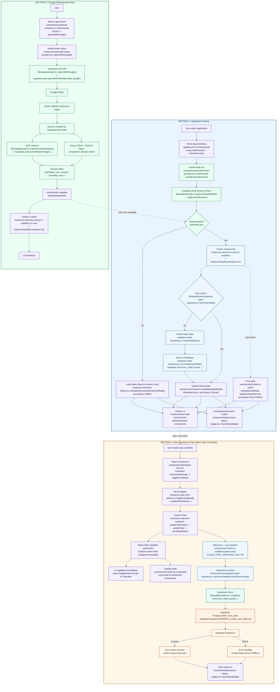

# Current Implementation Architecture

```mermaid
flowchart TB

%% =========================
%% SECTION 1: STARTUP
%% =========================
subgraph SEC1["SECTION 1 • Application Startup"]
direction TB
A0["User opens application"]
A1["React App bootstrap<br/>app/layout.tsx::RootLayout()<br/>wraps AuthProvider + TrackerProvider"]
A2["AuthProvider init<br/>components/providers/auth-provider.tsx::AuthProvider useEffect(initializeAuth)"]
A3["Supabase Auth Session Check<br/>lib/supabase/auth.ts::getCurrentAuthState()<br/>-> getCurrentSession()"]
A4{"Authenticated?<br/>authState.user"}
A5["Load Demo Data (in-memory only)<br/>hooks/use-interview-tracker.ts::setState(structuredClone(seedData))<br/>syncStatus='Offline'"]
A6["Render UI<br/>TrackerContext state consumed by dashboard/topic components"]
A7["Tracker startup load<br/>hooks/use-interview-tracker.ts useEffect<br/>-> loadUserStateByUserId(user.id)"]
A8{"Row exists?<br/>lib/repositories/supabase-state-repository.ts::fetchUserState()"}
A9["Create Initial State<br/>supabase-state-repository.ts::createInitialState()"]
A10["Save to Supabase<br/>supabase-state-repository.ts::insertInitialUserState()<br/>supabase.from('user_state').insert(...)"]
A11["Update React State<br/>useInterviewTracker.ts::setState(loadedState)<br/>isHydrated=true, syncStatus='Synced'"]
A12["Loading/syncing status visible<br/>components/layout/sync-status-badge.tsx::SyncStatusBadge"]
A13["Error path<br/>useInterviewTracker.ts catch:<br/>setState(seedData), skipNextSaveRef=true,<br/>syncStatus='Error'/'Offline'"]

A0 --> A1 --> A2 --> A3 --> A4
A4 -- "No" --> A5 --> A6
A4 -- "Yes" --> A7 --> A8
A8 -- "No" --> A9 --> A10 --> A11 --> A6
A8 -- "Yes" --> A11 --> A6
A7 -. "load failure" .-> A13 --> A6
A11 --> A12
A5 --> A12
A13 --> A12
end

%% =========================
%% SECTION 2: GOOGLE AUTH
%% =========================
subgraph SEC2["SECTION 2 • Google Authentication Flow"]
direction TB
B0["User"]
B1["React Login Button<br/>components/auth/auth-controls.tsx::AuthControls<br/>onClick -> signInWithGoogle()"]
B2["AuthProvider action<br/>components/providers/auth-provider.tsx::signInWithGoogle()"]
B3["Supabase Auth API<br/>lib/supabase/auth.ts::signInWithGoogle()<br/>-> supabase.auth.signInWithOAuth(provider:'google')"]
B4["Google OAuth"]
B5["OAuth Callback (redirectTo origin)"]
B6["Session Created by Supabase Auth SDK"]
B7["Access Token + Refresh Token<br/>contained in Session object"]
B8["Auth Listener<br/>lib/supabase/auth.ts::listenForAuthChanges()<br/>-> supabase.auth.onAuthStateChange(...)"]
B9["Session State<br/>AuthState { user, session, isLoading, error }"]
B10["AuthProvider updated<br/>setAuthState(state)"]
B11["Tracker Loaded<br/>hooks/use-interview-tracker.ts useEffect on user<br/>-> loadUserStateByUserId(user.id)"]
B12["UI Rendered"]

B0 --> B1 --> B2 --> B3 --> B4 --> B5 --> B6 --> B8 --> B9 --> B10 --> B11 --> B12
B6 --> B7
B7 --> B9
end

%% =========================
%% SECTION 3: PERSISTENCE
%% =========================
subgraph SEC3["SECTION 3 • Data Persistence Flow (Mark Topic Complete)"]
direction TB
C0["User marks topic complete"]
C1["React Component<br/>components/topic/topic-item.tsx<br/>Checkbox onCheckedChange -> toggleCompleted"]
C2["Hook adapter<br/>hooks/use-topic-item-actions.ts::toggleCompleted()<br/>-> updateTopicStatus(...)"]
C3["Tracker Hook<br/>hooks/use-interview-tracker.ts::<br/>updateTopicStatus -> updateTopic -> persist(setState)"]
C4["React State Updated (optimistic)<br/>TrackerContext state changes immediately"]
C5["UI Updated immediately<br/>status badge/strike-through in TopicItem"]
C6["Debounce + save pipeline<br/>useInterviewTracker.ts useEffect([state,user])<br/>CLOUD_SYNC_DEBOUNCE_MS=750"]
C7["Repository function<br/>lib/repositories/supabase-state-repository.ts::saveUserStateByUserId(userId,state)"]
C8["Supabase Client<br/>lib/supabase/client.ts::supabase<br/>.from('user_state').upsert(...)"]
C9["Database<br/>Postgres table: user_state<br/>supabase/migrations/20260711_create_user_state.sql"]
C10["Supabase Response"]
C11["Sync status success<br/>setSyncStatus('Synced')"]
C12["Error handling<br/>setSyncStatus('Error'/'Offline')"]
C13["Sync status UI<br/>components/layout/sync-status-badge.tsx::SyncStatusBadge"]
C14["Loading state<br/>useInterviewTracker.ts::isHydrated<br/>consumed by dashboard components"]

C0 --> C1 --> C2 --> C3 --> C4 --> C5
C3 --> C6 --> C7 --> C8 --> C9 --> C10
C10 -- "success" --> C11 --> C13
C10 -- "failure" --> C12 --> C13
C4 --> C14
end

%% Cross-section continuity
B10 -. "auth user available" .-> A4
A6 -. "topic interaction" .-> C0

%% Color coding by section
style SEC1 fill:#eaf4ff,stroke:#2f6fb3,stroke-width:2px,color:#0f2742
style SEC2 fill:#ecfff3,stroke:#2f8f57,stroke-width:2px,color:#0f2d1e
style SEC3 fill:#fff6ea,stroke:#b3741f,stroke-width:2px,color:#3d2a0b

%% Technology layer differentiation
classDef react fill:#f3f0ff,stroke:#6b4fd3,stroke-width:1.5px,color:#21124a
classDef auth fill:#e8fff3,stroke:#2f8f57,stroke-width:1.5px,color:#123522
classDef repo fill:#eef7ff,stroke:#2f6fb3,stroke-width:1.5px,color:#132f4a
classDef supa fill:#eafaf7,stroke:#0f766e,stroke-width:1.5px,color:#093733
classDef db fill:#fff1e8,stroke:#c2410c,stroke-width:1.5px,color:#4a1e09
classDef state fill:#fff7ed,stroke:#b45309,stroke-width:1.5px,color:#3a2107

class A0,A1,A5,A6,A11,A12,A13,B0,B1,B2,B10,B11,B12,C0,C1,C2,C3,C4,C5,C13,C14 react
class A2,A3,A4,B3,B4,B5,B6,B7,B8,B9 auth
class A7,A8,A9,A10,C6,C7 repo
class C8 supa
class C9 db
class C10,C11,C12 state
```
